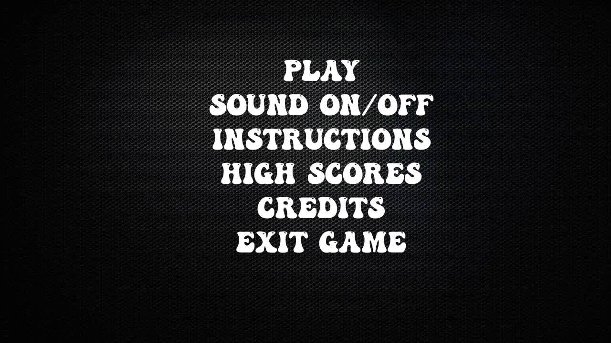
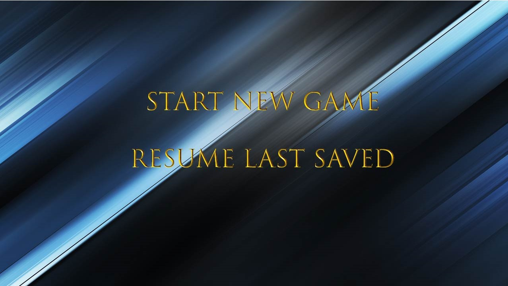
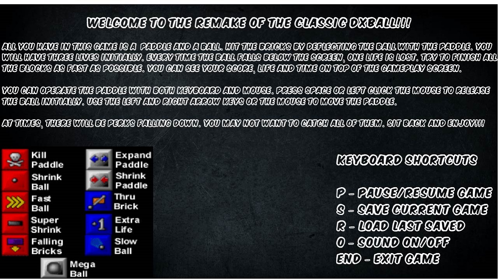
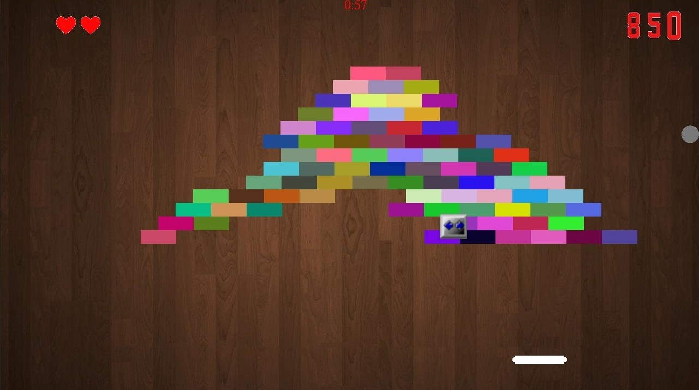
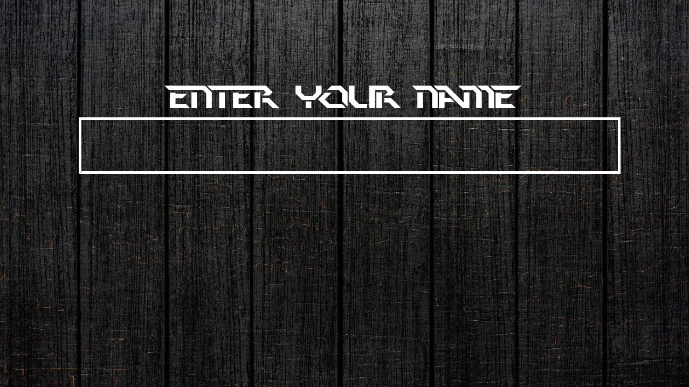
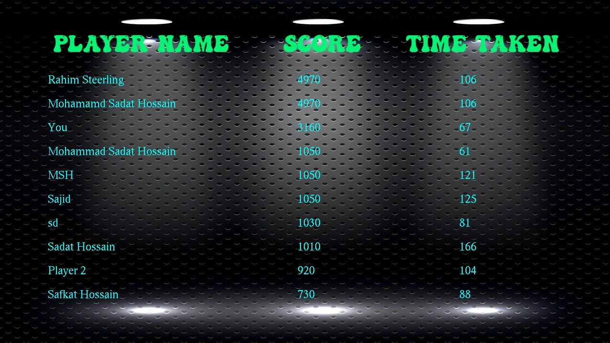

# DxBall Remake
## Welcome to the nostalgic DxBall!!!

This is an attempt to remake the legendary DxBall 2 as a part of our 
Level-1 Term-1 project using only C programming language. 

To play the game, go to "Executables for Downloading", download it, and play! Yes, it is really that easy!!!

---
---

## Gameplay Pictures

---
---

## Supported Features
* Close recreation of original game physics
* Contains background music and in-game sounds (Music Credits: **DxBall2**)
* Saving & loading game progress
* Pausing the game at any time
* Original game powerups
* Leaderboard
* Keyboard shortcuts for different purposes
